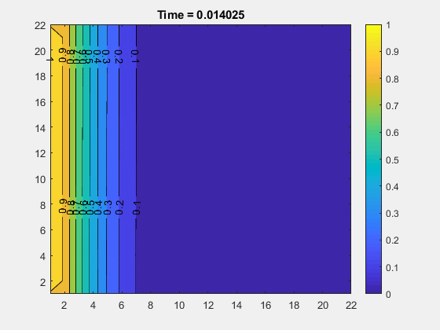
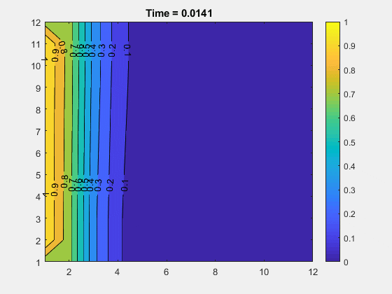

# Differentially Heated Cavity

Code to solve a square cavity with a temperature diffenrential in the side walls.
Using Prandtl and Rayleigh and the mesh size different simulations can be obtained.

## Results

- For Pr = 5 and Ra = 10:

- For Pr = 5 and Ra = 100:

- For Pr = 5 and Ra = 1000:

